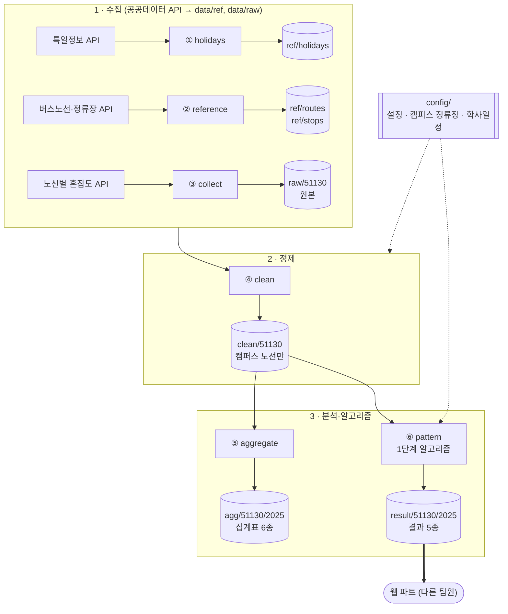
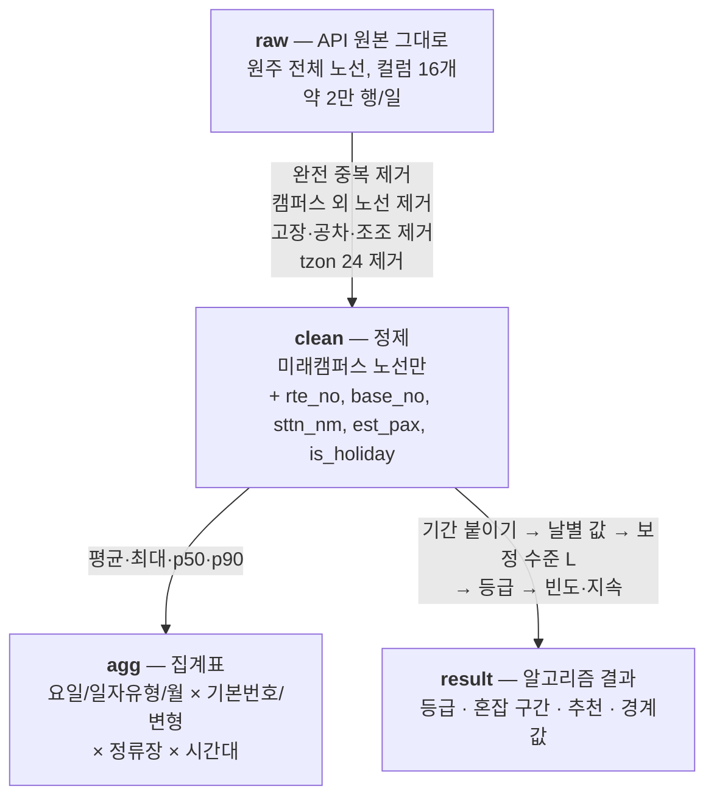
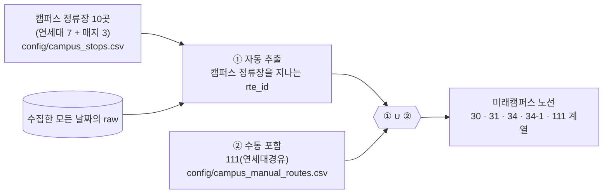
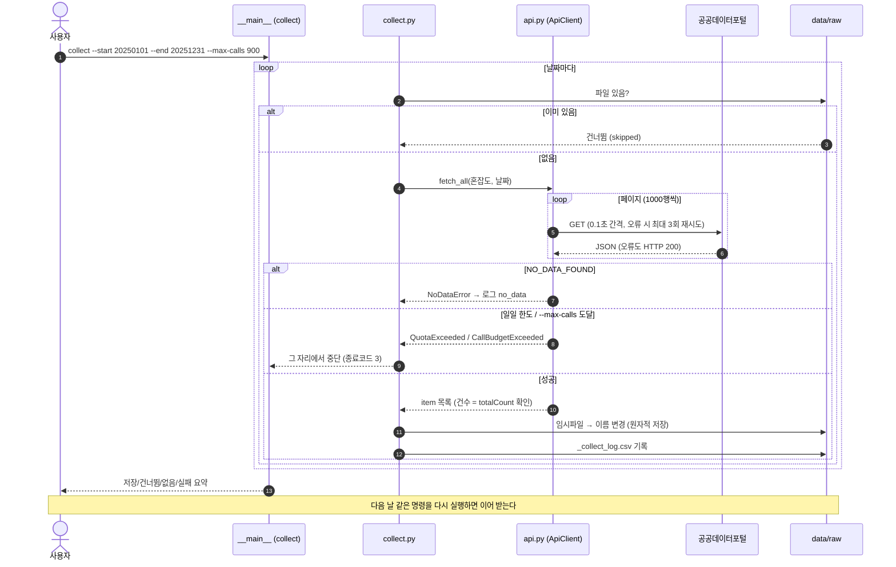
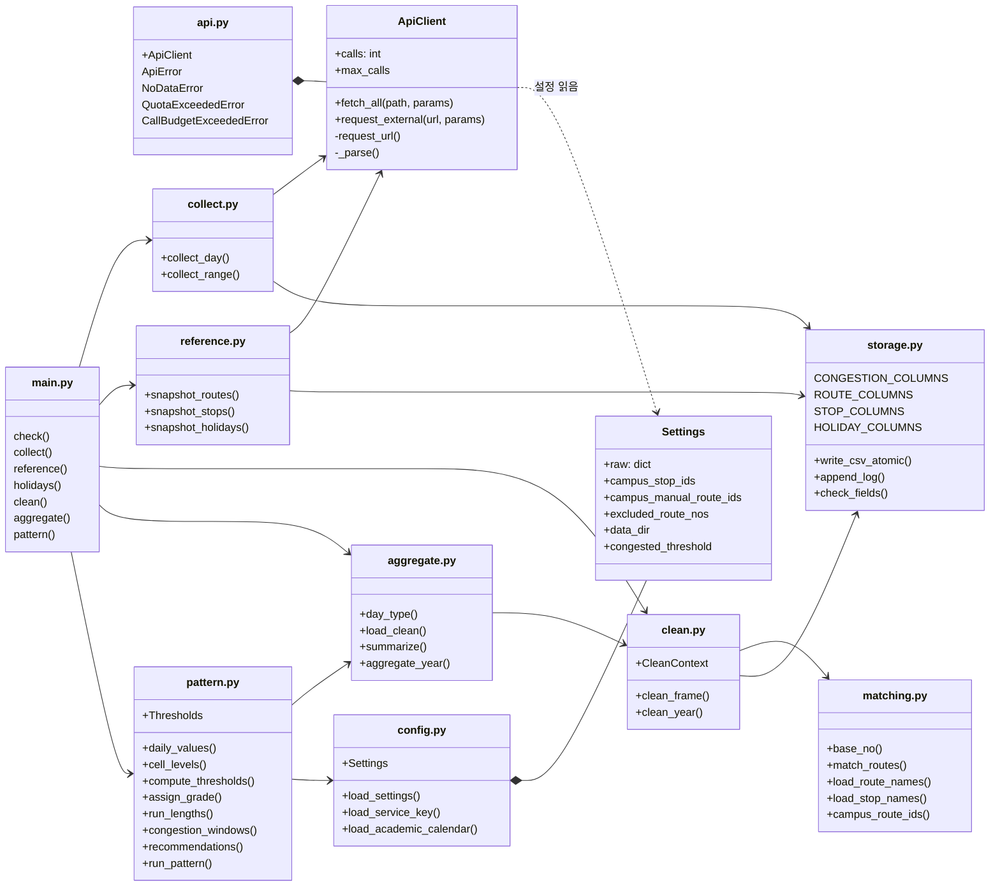
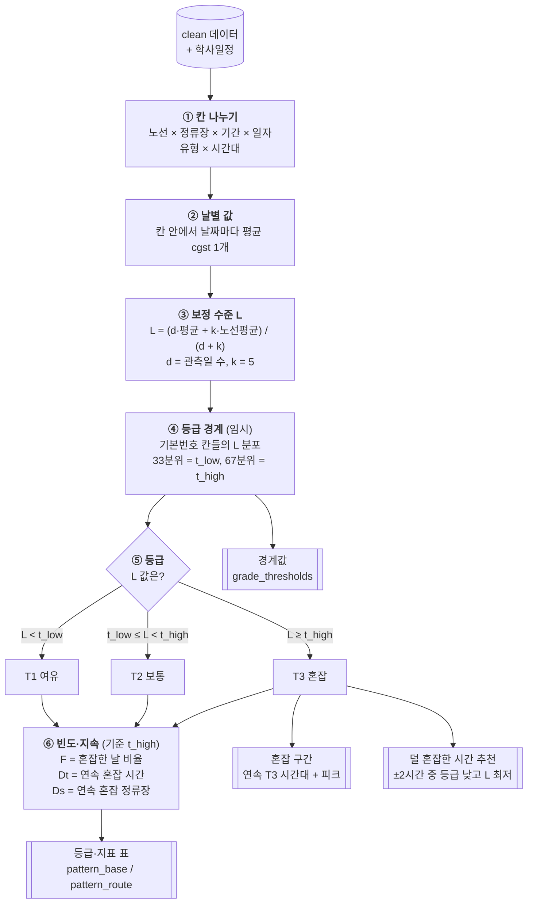
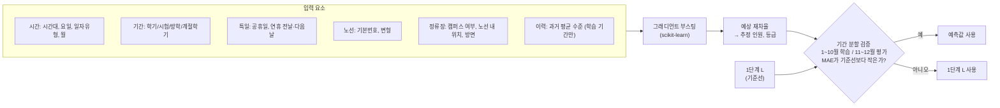
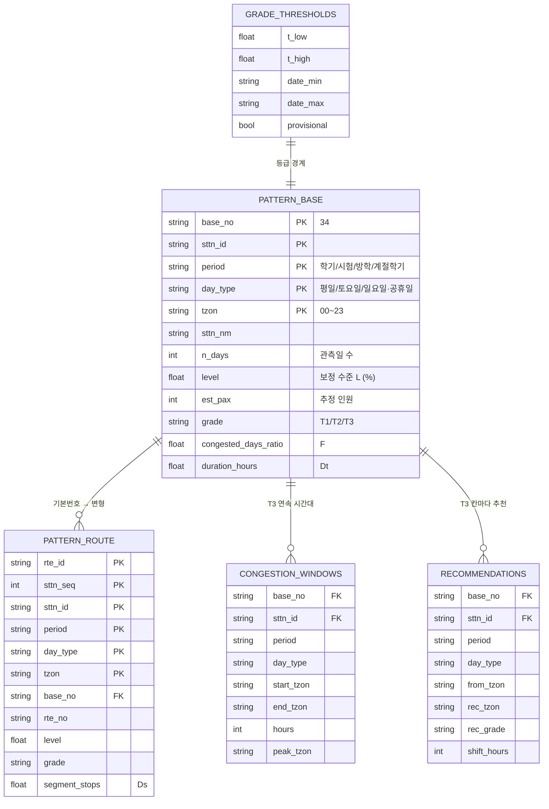
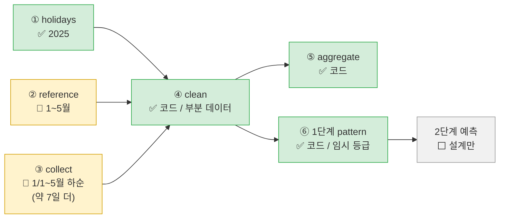

# 시스템 구조 한눈에 보기

8조 캡스톤 — 원주 미래캠퍼스 버스 혼잡도 **수집 → 정제 → 알고리즘** 파이프라인.
이 문서는 그림 위주 요약이다. 세부 규칙은 [CLAUDE.md](../CLAUDE.md), 알고리즘 설계는 [algorithm_design.md](algorithm_design.md), API 명세는 `docs/api_*.md`.

> 그림은 Mermaid로 작성했다. GitHub·VS Code(Markdown Preview Mermaid Support 확장)에서 자동으로 그려진다.

---

## 1. 전체 파이프라인

| 단계 | 명령 | 입력 | 출력 | 비고 |
|---|---|---|---|---|
| ① | `holidays --year 2025` | 특일정보 API | `ref/holidays/2025.csv` | 1회 호출 |
| ② | `reference --start … --end … --day-of-month 15` | 버스노선·정류장 API | `ref/routes/*.csv`, `ref/stops/*.csv` | 매월 15일 |
| ③ | `collect --start … --end … --max-calls 900` | 혼잡도 API | `raw/51130/{날짜}.csv` | 일일 한도 1,000회 → 며칠에 나눠 |
| ④ | `clean --year 2025` | raw + ref | `clean/51130/{날짜}.csv` | 항상 전체 재생성 |
| ⑤ | `aggregate --year 2025` | clean | `agg/51130/2025/by_*.csv` 6종 | 단순 통계 |
| ⑥ | `pattern --year 2025` | clean + 학사일정 | `result/51130/2025/*.csv` 5종 | **웹에 넘기는 결과** |

---

## 2. 데이터 단계별 변화

**미래캠퍼스 노선 판정**

---

## 3. 수집(collect) 동작 — 시퀀스

---

## 4. 코드 구조 — UML 클래스/모듈 다이어그램

| 모듈 | 역할 |
|---|---|
| `config.py` | `config/settings.toml`·CSV 목록·학사일정·`.env` 키 읽기 (키는 출력 안 함) |
| `api.py` | API 공통 호출: 페이지 넘김, 재시도, 호출 간격, 호출 수 세기, 오류 판정 |
| `storage.py` | CSV 컬럼 순서(팀과의 스키마 계약), 원자적 저장, 수집 로그 |
| `collect.py` | 혼잡도 하루 단위 수집, 이어받기 |
| `reference.py` | 노선·정류장·공휴일 목록 스냅샷 |
| `matching.py` | 기본번호(34연세대→34), 노선번호 검색, 이름 조회, 캠퍼스 노선 판정 |
| `clean.py` | 행 단위 정제 |
| `aggregate.py` | 집계표 6종 |
| `pattern.py` | 1단계 혼잡 패턴 지수 |

---

## 5. 1단계 알고리즘 — 혼잡 패턴 지수

**보정 수준 L이 필요한 이유** — 관측일이 하루뿐인 칸은 그날 우연히 튄 값이 그대로 "혼잡"이 될 수 있다. 관측일이 적을수록 같은 노선 평균 쪽으로 당겨 안정시킨다.

| 관측일 d | 이 칸 평균 | 노선 평균 | L (k=5) |
|---|---|---|---|
| 1일 | 90% | 35% | (1·90 + 5·35) / 6 ≈ **44%** |
| 10일 | 30% | 35% | (10·30 + 5·35) / 15 ≈ **32%** |

**혼잡 구간 예시** — 한 정류장의 시간대별 등급이 아래와 같으면

```mermaid
gantt
    title 34번 원주의료원 · 학기 · 평일 (예시)
    dateFormat HH
    axisFormat %H시
    section 등급
    T1 여유 :done, 07, 1h
    T2 보통 :active, 08, 1h
    T3 혼잡 (구간 1, 피크 12시) :crit, 10, 4h
    T2 보통 :active, 14, 1h
    T3 혼잡 (구간 2) :crit, 16, 2h
```

→ `congestion_windows.csv`에 "10~13시(피크 12시)", "16~17시" 두 구간이 나오고, 13시 혼잡 칸에는 ±2시간 중 덜 붐비는 14시(T2)가 추천된다.

---

## 6. 2단계 알고리즘 — 예측 모델 (설계만, 구현 전)

---

## 7. 웹 파트에 넘기는 결과 파일

- 위치: `data/result/51130/2025/` (CSV, UTF-8 BOM). **git에 포함**되어 레포에서 바로 받을 수 있다 (`data/agg/`, `data/ref/`도 포함, `data/raw/`·`data/clean/`은 용량 때문에 제외).
- 현재 커밋된 결과의 데이터 기간은 `grade_thresholds.csv`의 `date_min`~`date_max`로 확인한다.
- 등급은 **임시 기준**(1/3 분위수)이다. 2025년 수집이 끝나면 최종 기준을 다시 정하며, `grade_thresholds.csv`의 `provisional`로 구분한다.
- 결과 형식(CSV/JSON)·컬럼은 웹 팀원과 합의 후 확정한다.

---

## 8. 현재 진행 상황 (2026-10-06)

